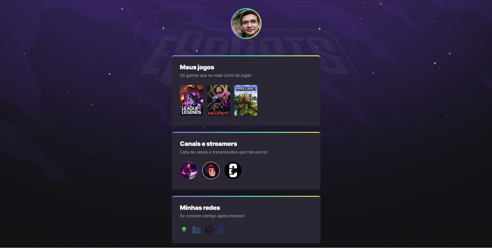

# NLW eSports Explorer
> Trilha Explorer
Projeto de site desenvolvido durante o evento do Next Level Week da RocketSeat.

### [🔗Acesse aqui para acessar a página](https://ngemir.github.io/NLW-Esport-Explorer/)
###  [Meu Contato](https://linktr.ee/emirng)

## 🛠 Tecnologias
- HTML
- CSS
- Git & Github

## O que foi praticado
- Acessar imagem pelo link
- Direcionar para o link ao clicar
- Animação no CSS
- Uso do SVG

## Agradecimento
### 

### [   
Mayk Brito (instrutor)
](https://github.com/maykbrito)
